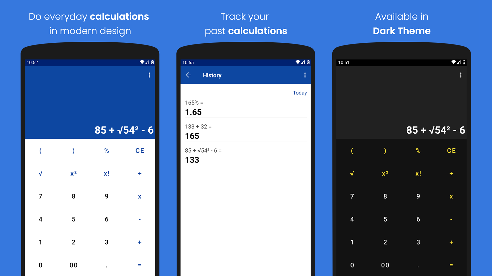

## MC Calculator
> Do everyday simple or complex calculations in modern design.

[](LICENSE.md)
[](https://kotlinlang.org)

MC Calculator is a viable tool in an intuitive design for everyone from those who are looking for 
basic arithmetic calculations to more advanced users.

## Features
- Supports the dark theme
- Easy to use scientific calculator
- Calculation history
- Basic operations: addition, subtraction, division, multiplication
- Advanced operations: percentages, square roots, exponentiation, exponential and factorial functions
- Calculations with negative numbers
- Parenthesis and nested parenthesis for complex equations calculation
- Trigonometric and logarithmic functions
- Constants: PI, e, ln2
- Degree and radians calculations

## Get it on

[](https://play.google.com/store/apps/details?id=com.maximcode.mccalculator)

## Screenshots



### Scientific mode

[](screenshot_land.png)

## Tech Stack & Open-source libraries

- Minimum SDK level 23
- Kotlin
- Dagger Hilt
- Mockk
- RxJava, RxBinding, [RxMvi](https://github.com/merklol/RxMvi)
- [ViewBindingPropertyDelegate](https://github.com/kirich1409/ViewBindingPropertyDelegate)
- Jetpack(RecyclerView, Room Database, Navigation Component)


## Suggestions

If you have general suggestions, please feel free to submit a new 
[Github issue](https://github.com/merklol/MC-Calculator/issues/new).


## License

All the code available under the MIT license. See [LICENSE](LICENSE.md).
```
MIT License

Copyright (c) 2021 Maxim Smolyakov

Permission is hereby granted, free of charge, to any person obtaining a copy
of this software and associated documentation files (the "Software"), to deal
in the Software without restriction, including without limitation the rights
to use, copy, modify, merge, publish, distribute, sublicense, and/or sell
copies of the Software, and to permit persons to whom the Software is
furnished to do so, subject to the following conditions:

The above copyright notice and this permission notice shall be included in all
copies or substantial portions of the Software.

THE SOFTWARE IS PROVIDED "AS IS", WITHOUT WARRANTY OF ANY KIND, EXPRESS OR
IMPLIED, INCLUDING BUT NOT LIMITED TO THE WARRANTIES OF MERCHANTABILITY,
FITNESS FOR A PARTICULAR PURPOSE AND NONINFINGEMENT. IN NO EVENT SHALL THE
AUTHORS OR COPYRIGHT HOLDERS BE LIABLE FOR ANY CLAIM, DAMAGES OR OTHER
LIABILITY, WHETHER IN AN ACTION OF CONTRACT, TORT OR OTHERWISE, ARISING FROM,
OUT OF OR IN CONNECTION WITH THE SOFTWARE OR THE USE OR OTHER DEALINGS IN THE
SOFTWARE.
```